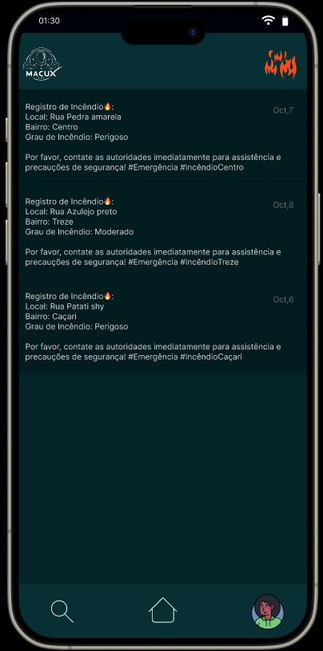
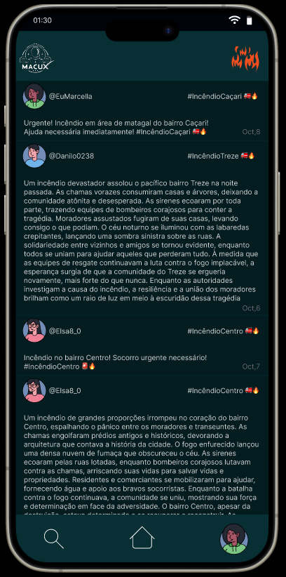

<h1 align="center">EYE FIRE, LOOK THIS!</h1>
<h3 align="center">Your Fire Information App</h3>

FIGMA PROTOTYPE: <a target="_blank" href="https://www.figma.com/proto/I9dH8Y6R8r3TDMuvGHD7U2/Untitled?type=design&node-id=2-74&t=iHWN5zoYnaM7Gpo3-1&scaling=scale-down&page-id=0%3A1&starting-point-node-id=2%3A74&mode=design">FIGMA PROTOTYPE (CLICK HERE)</a> 

See what we did in a short time with data provided by NASA:  

A presentation in PDF: <a href="NASA_Space_Apps_2023_-_MacuX_-_EyeFire (3).pdf">PDF (CLICK HERE)</a>

 

Want to see these images interactively? <a target="_blank" href="https://www.figma.com/proto/I9dH8Y6R8r3TDMuvGHD7U2/Untitled?type=design&node-id=2-74&t=iHWN5zoYnaM7Gpo3-1&scaling=scale-down&page-id=0%3A1&starting-point-node-id=2%3A74&mode=design">FIGMA PROTOTYPE (CLICK HERE)</a>

 

   
   
   
   

